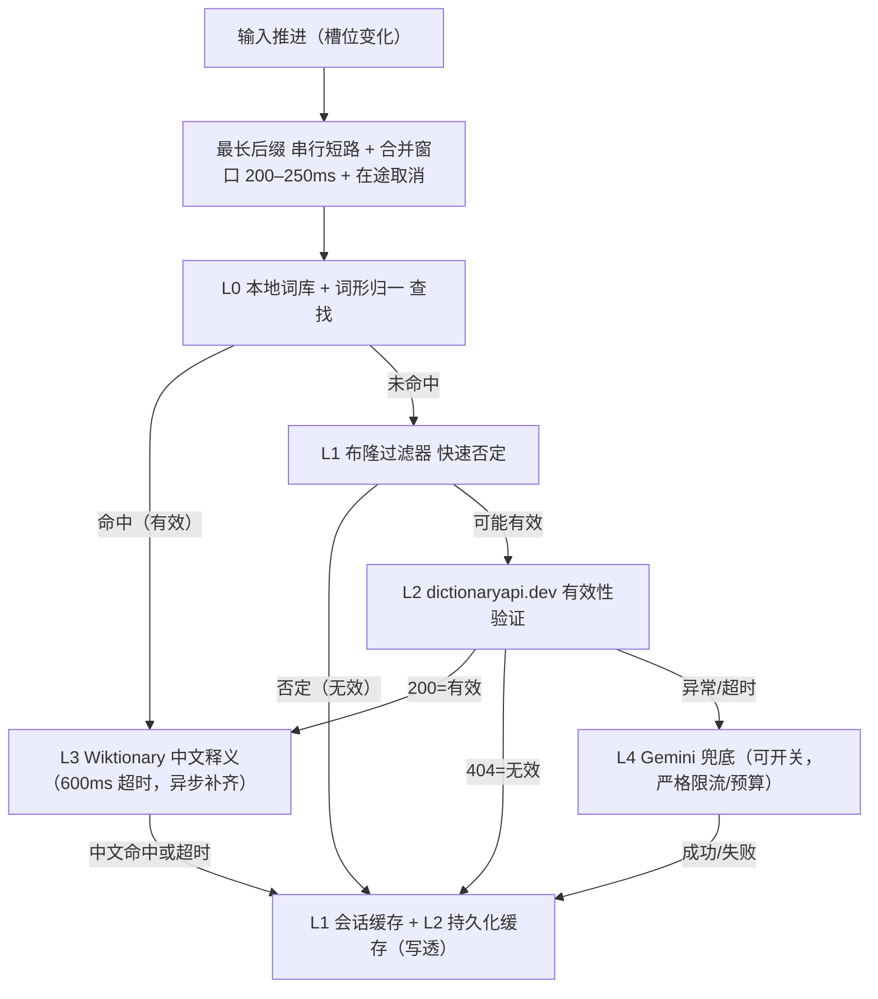

# 快速否定层 + dictionaryapi.dev 有效性验证 + Wiktionary 中文释义（含 Gemini 可切换兜底）——终极可落地方案（v1）

状态：可执行设计（本次仅文档与参数落地，代码改动按本文“实施清单”推进）  
适用范围：叠叠乐“单词验证 + 中文释义”能力  
目标：在不依赖 LLM 的前提下实现“极快、极省配额、覆盖率高”的验证与中文释义；保留 Gemini 作为可配置兜底开关。

## 1. 设计目标与非目标
- 目标
  - 极低延迟：大多数在本地完成；少量网络验证在 150–300ms 内给出“有效/无效”；中文释义 300–900ms 内异步补齐。
  - 极低成本：默认不调用 LLM；调用 LLM 仅在明确“必要且仍未知”时，且受严格限流与预算。
  - 高可控：全链路限流、合并、在途取消；强缓存（会话 L1 + 持久化 L2）。
  - 可回退：一键切换 Gemini 兜底开关；随时回退到旧路径。
- 非目标
  - 不承诺 100% 词覆盖；对极个别长尾允许“暂未知”并以英文占位，待缓存完善。

## 2. 总体流程（先判有效性，再补中文）



说明  
- “有效性”一旦确定即可驱动游戏逻辑（消除/计分等），中文释义异步补齐，不阻塞 UI。  
- 合并窗口 + 在途取消确保同一输入阶段最多只落一个远端请求。  

## 3. 触发策略与并发治理
- 保留并强化：“最长后缀 串行短路 + 200–250ms 合并窗口 + 在途取消”
  - 结论：仍然必要。即便改用轻量 API，快速点击下仍可能产生瞬时并发；保留该策略能将请求压至最小且保持“以最新输入为准”。
  - 实施要点：
    - 仅对“最长后缀”进入远端阶段；若返回“无效”且仍然是同一输入版本，可按需要降阶尝试更短后缀（通常无需）。
    - 合并窗口 200–250ms：收敛输入抖动；窗口内仅保留“最后一次”。
    - 在途取消：新一轮输入开始时，取消旧请求（AbortController）。
- 全局限流与队列（客户端）
  - Token Bucket：capacity=6，refill=2/sec（默认）；并发=1；队列长度=3；过载丢弃并静默。
  - 针对 LLM 兜底另设更严参数：capacity=1，refill=0.1/sec（约 1 次/10s），每日 10 次/客户端上限。

## 4. 组件设计
### 4.1 L0 本地词库 + 词形归一
- 词形归一规则：`s|es|ies|ed|ing|er|est` 可逆归一（示例：`flies→fly`、`studies→study`、`bigger→big`）再查一遍本地词库。
- 本地词库：现有 `words_core.json` / `words_extended.json` / `zh_gloss_extended.json`。命中即“有效”；若 `zh_gloss_extended` 命中，直接得到中文释义。

### 4.2 L1 布隆过滤器（快速否定层）
- 目的：极快地判定“不可能是英文单词”，将大量噪声在本地拦截。
- 词表来源（超集）：SCOWL + wordfreq 英语词库（离线构建）。  
- 参数建议：n≈1,000,000 词；FPR≈1%；bits/word≈10；位数组≈1.2MB（gzip 更小）。  
- 辅助轻规则（仅拦明显噪声）：必须含元音或 y；禁止 3 连同字母；`q` 后须跟 `u`；少量非法 bigram 黑名单。  
- 离线构建脚本（建议）：`tools/words/build_bloom.py`；产物：`src/cocos/assets/bundle/words/english.bloom`（二进制）；加载器在启动时异步拉取。

### 4.3 L2 dictionaryapi.dev（有效性验证）
- 接口：`GET https://api.dictionaryapi.dev/api/v2/entries/en/{word}`  
- 语义：200=有效（返回数组）；404=无效；其余为异常（网络/5xx）。  
- 时限：超时 600ms；并发=1；队列长度=3；遵守全局 Token Bucket。  
- CORS：支持浏览器直连；失败可回退 Worker 代理路径（可选）。  
- 解析：取 `data[0].meanings?.[0].definitions?.[0].definition` 作为英文定义（可缓存备用）。  

### 4.4 L3 Wiktionary（中文释义）
- 触发条件：已确定“有效”，但本地无中文释义。  
- 首选 API（wikitext，含“Translations”段）：  
  - `https://en.wiktionary.org/w/api.php?action=parse&page={word}&prop=wikitext&format=json`  
  - 解析 wikitext 的 “Translations” 小节，抽取“Chinese/中文/zh”的译词。  
- 备选 API（REST v1 定义）：  
  - `https://en.wiktionary.org/api/rest_v1/page/definition/{word}`（多为英文定义，中文需二次跳转，命中率低一点）  
- 时限：600ms；结果可为空。  
- CORS：如直连受限，走 Worker 代理 `/wiktionary/*`（见“扩展项”）。  
- 正规化：见“4.6 中文释义短词化规范（强制）”，所有 Wiktionary 结果入库前先做短词化与长度裁剪。

### 4.5 L4 Gemini 兜底（可开关）
- 开关：`GEMINI_FALLBACK_ENABLED`（默认 false）。  
- 触发：dictionaryapi.dev 异常/超时且 Wiktionary 未得中文，且本客户端“每日预算未用尽”。  
- 限流：并发=1；Token Bucket（1/10s）；每日≤10 次/客户端；指数退避 + 抖动；尊重 Retry-After。  
- 提示词：输入 dictionaryapi.dev 的第一条英文定义，输出必须满足“4.6 中文释义短词化规范（强制）”，并要求 JSON 严格结构化。  
- 解析失败不落盘，避免污染缓存。

### 4.6 中文释义短词化规范（强制）
- 目标：中文释义只展示“几个简洁的译词”，绝不出现长句或解释性段落。  
- 规范（对 Wiktionary/Gemini 等所有来源统一适用）：
  - 仅保留 1–3 个“中文短译词”，使用“、”连接；
  - 总长度 ≤ 25 字（按词边界裁剪，避免截断半个词）；
  - 移除括注/例句/引号/连字符及其它冗余标记（如“(…)/(俗)/～等”）；
  - 去重、去空白，统一为简体中文；
  - 若无法抽取任何短译词，则不填写中文（保留英文或占位）；缓存中也只存“已规范化的结果”。
- 规范化函数（建议名 `normalizeZh`）职责：
  - 输入候选中文字符串或列表 → 提取词项 → 清洗与去重 → 长度裁剪 → 用“、”连接并返回。

## 5. 缓存策略（写透）
- L1 会话缓存：Map + LRU（建议 8000）；生命周期随会话。  
- L2 持久化缓存：Web 端 `cc.sys.localStorage` 单键大对象；原生端可选 JSONL + 旋转压缩。  
- 键：统一大写（A–Z）；值：`{ valid: boolean, definitionEn?: string, definitionZh?: string, source: 'local'|'dict'|'wiktionary'|'gemini', ts: number, ttlMs: number }`  
- TTL：valid=7d；invalid=3d；异常/429/5xx 不落盘。  
- 回写：L2 命中回写 L1；本地词库命中也可回写，以统一来源统计。  
- 入库规则：中文释义入库前必须执行“4.6 中文释义短词化规范（强制）”，缓存仅保存已规范化结果。

## 6. 配置清单（建议新增到 `src/cocos/assets/scripts/config/word-validate.ts`）
- 合并窗口：`REMOTE_MERGE_WINDOW_MS = 220`  
- 远端并发：`REMOTE_CONCURRENCY = 1`，`REMOTE_QUEUE = 3`  
- 全局限流：`RATE_CAPACITY = 6`，`RATE_REFILL_PER_SEC = 2`  
- 字典/维基超时：`DICT_TIMEOUT_MS = 600`，`WIKI_TIMEOUT_MS = 600`  
- 兜底：`GEMINI_FALLBACK_ENABLED = false`，`GEMINI_DAILY_BUDGET = 10`，`GEMINI_MIN_INTERVAL_MS = 10000`
- 缓存 TTL：`CACHE_TTL_VALID_MS = 7*24*3600*1000`，`CACHE_TTL_INVALID_MS = 3*24*3600*1000`
- 布隆：`BLOOM_PATH = 'assets/bundle/words/english.bloom'`，`BLOOM_FPR = 0.01`

## 7. 客户端集成（核心伪代码）
```ts
// 关键接口（建议补到 src/cocos/assets/scripts/types/words.ts）
export type ValidateResult = {
  word: string; valid: boolean;
  definitionEn?: string; definitionZh?: string;
  source: 'local' | 'dict' | 'wiktionary' | 'gemini' | 'cache';
};

// 入口（WordValidationManager）
async function validateWordPipeline(inputWord: string, inputVersion: number): Promise<ValidateResult> {
  const w = inputWord.toUpperCase();
  // 0) 缓存命中
  const cached = cacheGet(w);
  if (cached) return markSource(cached, 'cache');

  // 1) 本地词库 + 词形归一
  const local = localLookupWithLemmatize(w);
  if (local.hit) {
    const zh = local.zhDefinition; // 可能为空
    const result = { word: w, valid: true, definitionZh: zh, source: 'local' } as ValidateResult;
    cachePut(w, result); return result;
  }

  // 2) 布隆快速否定
  if (!bloomMightContain(w) || violatesLightRules(w)) {
    const result = { word: w, valid: false, source: 'local' } as ValidateResult;
    cachePut(w, withTtlInvalid(result)); return result;
  }

  // 3) 合并窗口 + 在途取消由上层调度（最长后缀）
  // 4) dictionaryapi.dev（有效性）
  const dict = await fetchDictionaryApi(w, { timeout: 600 });
  if (dict.status === 200) {
    const definitionEn = dict.firstDefinition;
    let result: ValidateResult = { word: w, valid: true, definitionEn, source: 'dict' };
    cachePut(w, withTtlValid(result)); // 先写英文

    // 5) Wiktionary 中文（异步，不阻塞游戏）
    fetchWiktionaryZh(w, { timeout: 600 })
      .then(zh => {
        if (zh) {
          result = { ...result, definitionZh: normalizeZh(zh), source: 'wiktionary' };
          cachePut(w, withTtlValid(result)); // 回写中文
          // 可触发 UI 局部刷新：DefinitionHint 更新
        }
      })
      .catch(() => void 0);
    return result;
  }
  if (dict.status === 404) {
    const result = { word: w, valid: false, source: 'dict' } as ValidateResult;
    cachePut(w, withTtlInvalid(result)); return result;
  }

  // 6) 兜底（可开关）
  if (GEMINI_FALLBACK_ENABLED && underGeminiBudget()) {
    const g = await fetchGeminiZh(w, { minIntervalMs: 10000, timeout: 6000 }).catch(() => null);
    if (g?.definitionZh) {
      const result = { word: w, valid: true, definitionZh: normalizeZh(g.definitionZh), source: 'gemini' } as ValidateResult;
      cachePut(w, withTtlValid(result)); return result;
    }
  }
  // 未知或异常：不阻塞，按“无效/未知”处理（可返回 valid=false，不落盘）
  return { word: w, valid: false, source: 'local' } as ValidateResult;
}
```

## 8. 接口细节与示例
- dictionaryapi.dev  
  - `GET https://api.dictionaryapi.dev/api/v2/entries/en/cat` → 200（数组）  
  - `GET https://api.dictionaryapi.dev/api/v2/entries/en/zzzz` → 404（`{"title":"No Definitions Found"}`）  
- Wiktionary（wikitext）
  - `GET https://en.wiktionary.org/w/api.php?action=parse&page=cat&prop=wikitext&format=json`  
  - 解析“Translations”小节中 `zh` 目标词；600ms 超时；失败即跳过。
- Worker 代理（可选）
  - `/wiktionary/parse?page={word}` → 代理前述 MediaWiki API，注入 CORS、限流与缓存。

## 9. 指标与日志（最小集）
- 客户端埋点：`validate.remote.invoked`、`validate.remote.skipped`、`validate.result.source`、`validate.latency.ms`  
- 关键比率：远端触发率、404 比率、中文补齐成功率、p50/p95 延迟  
- 控制台日志：仅在调试开关下打印（遵循“省钱需知”）。

## 10. 验收与测试
- 案例
  - 明显无效词（如 `"ZZQTT"`）：L1 直接否定，<1ms。  
  - 可能有效但实际 404：dictionaryapi.dev 返回 404，150–300ms。  
  - 有效且本地无中文：200ms 左右拿到英文，随后 300–900ms 拿到中文或超时。  
  - 快速点击：合并窗口内仅 1 次远端；旧在途被取消；不出现“旧结果误消除”。  
- 回归场景：与现有“输入版本号 + stopBlink + validationsInFlight”一致性验证。

## 11. 上线与回滚
- 上线
  - 添加配置常量；接入布隆；植入远端阶段（dictionaryapi.dev → Wiktionary → Gemini 开关）；开启写透缓存。  
  - 默认关闭 `GEMINI_FALLBACK_ENABLED`。  
- 回滚
  - 仅切开关：开启 `GEMINI_FALLBACK_ENABLED`（旧 LLM 路径恢复生效）。  
  - 如需完全回退：移除远端阶段改动，恢复仅本地+Gemini 的旧实现。

## 12. 实施清单（开发任务拆解）
1) 配置与类型：新增 `config/word-validate.ts` 常量；`types/words.ts` 扩展 `ValidateResult`。  
2) 布隆：编写 `tools/words/build_bloom.py`，产出 `english.bloom`；前端加载器与查询函数。  
3) 词形归一：实现归一函数并接入本地词库查找。  
4) 远端阶段接入：`WordValidationManager` 中按“最长后缀+合并窗口+在途取消”对接 `dictionaryapi.dev` 与 `fetchWiktionaryZh`。  
5) 缓存：会话 LRU 与本地持久化（统一键、TTL、写透）。  
6) Gemini 兜底：开关、预算、限流与调用封装（沿用现有 Worker `/gemini/generate`）。  
7) 指标：最小埋点；调试日志可控。  
8) 验收：按第 10 节用例执行验证。

## 13. 预期性能
- 明显无效词：<1ms（本地返回）  
- 可能有效但最终无效：150–300ms  
- 有效且需中文：400–900ms（有效性先至，中文异步补齐）  
- 二次命中缓存：<1–5ms（会话）/ ≈5–10ms（持久化）


