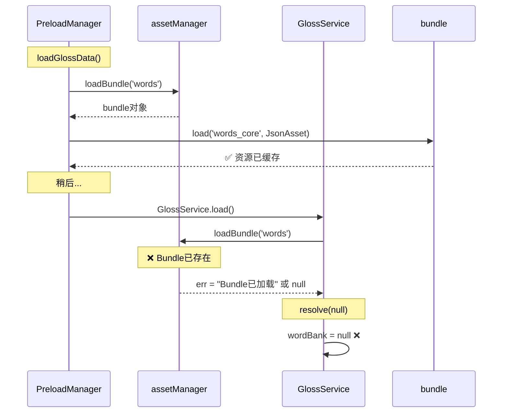
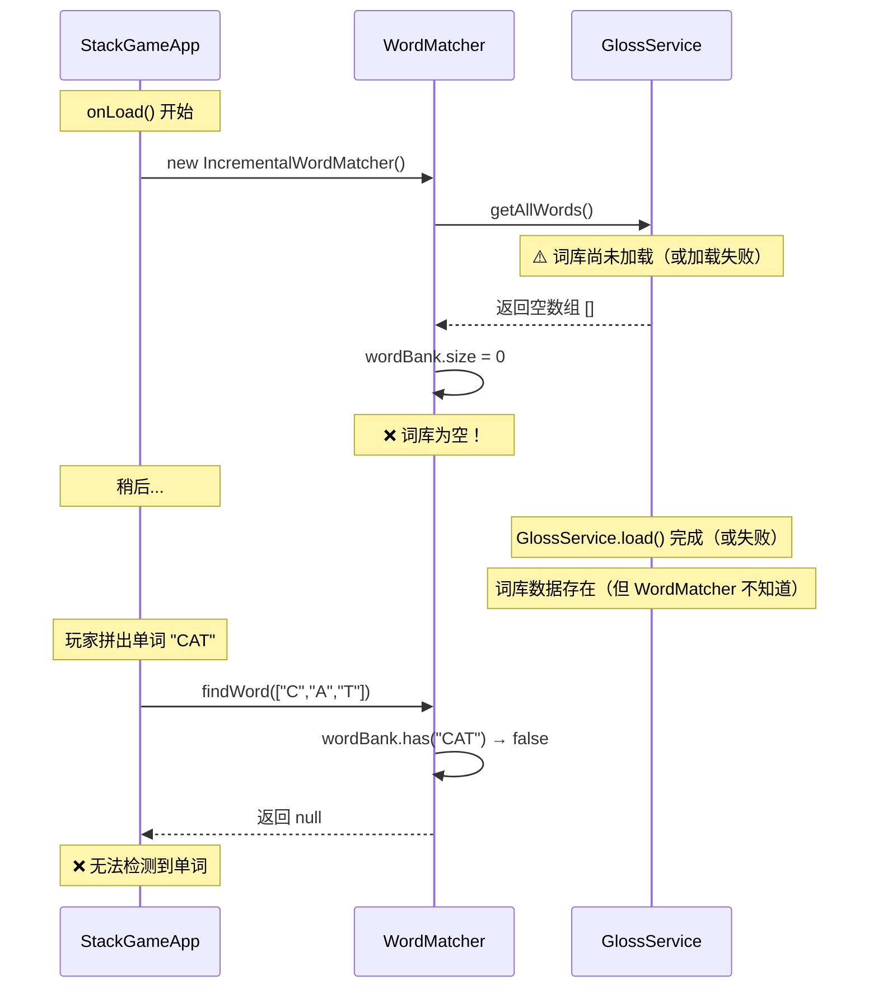

# 002 - 单词检测机制初始化顺序问题修复

## 问题背景

根据设计文档 `stack_word_game_design_complete.md` 第 11 章「单词检测算法」的要求，牌堆字母卡片飞到牌槽时应该**自动触发单词检测**，检测到有效单词时触发闪烁动画并提示玩家消除或继续拼词。

### 预期行为

1. 玩家点击字母卡片
2. 卡片飞向牌槽动画
3. 字母添加到牌槽队列
4. **自动触发单词检测**
5. 检测到有效单词 → 触发闪烁 + 显示按钮
6. 未检测到单词 → 继续等待下一个字母

### 实际报错

```
[GlossService] 词库未加载或格式错误
[StackGameApp] ❌ GlossService 词库为空，WordMatcher 初始化失败
[StackGameApp] 请确保 GlossService.load() 在 WordMatcher 初始化前完成
```

---

## 问题诊断

### 现状分析 ✅

经过代码审查，单词检测机制在**代码层面已完整实现**：

#### 1. 事件触发链路正常 ✅
```typescript
// SlotQueue.ts:207
this.node.emit('letter-added', this.slotManager.getLetters());
```

#### 2. 事件监听正常 ✅
```typescript
// StackGameApp.ts:78
this.slotQueue.node.on('letter-added', this.onLetterAdded, this);
```

#### 3. 单词检测逻辑正常 ✅
```typescript
// StackGameApp.ts:240-263
private onLetterAdded(letters: string[]): void {
    const match = this.wordMatcher.findWord(letters);
    if (match) {
        this.currentMatch = match;
        this.gameState = GameState.BLINKING;
        this.slotQueue.startBlink(match);
    }
}
```

#### 4. WordMatcher 算法正确 ✅
- 增量检测优化（快速路径）
- 完整检测降级（兼容性保证）
- 词库查找逻辑无误

#### 5. PreloadManager Bundle预加载正确 ✅

**Bundle资源预加载检查结果**：

| Bundle | 配置的预加载资源 | 实际bundle文件 | 状态 |
|--------|----------------|--------------|------|
| **bg** | `main_scene_bg/spriteFrame`<br>`game_scene_bg/spriteFrame`<br>`result_scene_bg/spriteFrame` | ✅ 全部匹配 | ✅ 正确 |
| **title** | `title/spriteFrame` | ✅ `title.png` | ✅ 正确 |
| **tiles** | 5个瓦片资源 | ✅ 全部匹配 | ✅ 正确 |
| **slot** | `slot_item/spriteFrame` | ✅ `slot_item.png` | ✅ 正确 |
| **words** | `words_core`<br>`zh_gloss`<br>`words_extended`<br>`zh_gloss_extended` | ✅ 全部匹配 | ✅ 正确 |
| **modal** | `pop_card/spriteFrame` | ✅ `pop_card.png` | ✅ 正确 |

**结论**：所有Bundle资源都已在 `PreloadManager.ASSETS_TO_PRELOAD` 中正确配置。

---

### 根本问题 ⚠️ 两个关键错误

#### 问题1：GlossService 未使用 Bundle 缓存 ❌ 严重

**症状**：`PreloadManager` 已在第88行调用 `loadGlossData()` 完成词库预加载，但 `GlossService.getAllWords()` 仍然返回空数组。

**根本原因**：`GlossService.loadJsonFromBundle()` 方法**重复加载Bundle**，导致加载冲突。

**问题代码**（GlossService.ts:211-236）：
```typescript
private async loadJsonFromBundle(bundleName: string, assetPath: string): Promise<JsonAsset | null> {
    return new Promise((resolve) => {
        console.log(`[GlossService] 尝试从Bundle '${bundleName}' 加载资源: ${assetPath}`);

        // ❌ 问题：每次都调用 loadBundle()，不检查缓存
        assetManager.loadBundle(bundleName, (err, bundle) => {
            if (err) {
                console.error(`[GlossService] Bundle '${bundleName}' 加载失败:`, err);
                resolve(null);  // ❌ Bundle已存在时返回错误，导致词库加载失败
                return;
            }

            // ❌ 问题：不检查资源是否已缓存
            bundle.load(assetPath, JsonAsset, (err, asset) => {
                // ...
            });
        });
    });
}
```

**正确的缓存使用方式**（参考 AssetLoader.ts）：
```typescript
// ✅ 步骤1：检查Bundle是否已缓存
let bundle = assetManager.getBundle(bundleName);

if (bundle) {
    console.log(`[AssetLoader] 使用缓存的Bundle: ${bundleName}`);

    // ✅ 步骤2：使用bundle.get()获取已完全加载的资源
    const cachedAsset = bundle.get(assetPath, JsonAsset);
    if (cachedAsset) {
        console.log(`[AssetLoader] ✅ 立即获取已缓存资源`);
        return cachedAsset; // 立即返回，零延迟
    }

    // ✅ 步骤3：资源未缓存，动态加载
    bundle.load(assetPath, JsonAsset, ...);
} else {
    // ✅ 步骤4：Bundle未缓存，才调用loadBundle
    assetManager.loadBundle(bundleName, ...);
}
```

**时序分析**：



#### 问题2：WordMatcher 初始化时机过早 ❌ 次要

**症状**：`StackGameApp.onLoad()` 中调用 `initWordMatcher()`，此时 `GlossService` 可能未加载完成。

**问题代码**（StackGameApp.ts:56-59）：
```typescript
protected async onLoad(): Promise<void> {
    // ❌ 此时 GlossService 可能未加载
    this.initWordMatcher();

    await this.loadRemoteAssets();
    // ...
}
```

**初始化流程错误示意**：



---

## 修复方案

### 方案 A：修复 GlossService Bundle 缓存机制 ⭐ 必须实施

#### 目标
让 `GlossService` 正确使用 `PreloadManager` 预加载的 Bundle 缓存，参考 `AssetLoader` 的实现模式。

#### 修改文件：`src/cocos/assets/scripts/data/GlossService.ts`

##### 修改点 1：重构 `loadJsonFromBundle()` 方法（211-236行）

**替换为**：
```typescript
/**
 * 从Bundle加载JSON资源（优先使用缓存）
 * 参考 AssetLoader.loadSpriteFrame() 的缓存机制
 * @param bundleName Bundle名称
 * @param assetPath 资源路径
 * @returns Promise<JsonAsset | null>
 */
private async loadJsonFromBundle(bundleName: string, assetPath: string): Promise<JsonAsset | null> {
    return new Promise((resolve) => {
        console.log(`[GlossService] 尝试从Bundle '${bundleName}' 加载资源: ${assetPath}`);

        // ✅ 步骤1：检查Bundle是否已缓存（使用官方API）
        let bundle = assetManager.getBundle(bundleName);

        if (bundle) {
            console.log(`[GlossService] ✅ Bundle '${bundleName}' 已缓存，直接使用`);

            // ✅ 步骤2：检查资源是否已完全加载
            const cachedAsset = bundle.get(assetPath, JsonAsset);

            if (cachedAsset) {
                console.log(`[GlossService] ✅ 资源 '${assetPath}' 已缓存，立即返回`);
                resolve(cachedAsset);
                return;
            }

            console.log(`[GlossService] ⚠️ 资源 '${assetPath}' 未缓存，开始动态加载`);

            // ✅ 步骤3：资源未缓存，动态加载
            bundle.load(assetPath, JsonAsset, (err, asset) => {
                if (err) {
                    console.error(`[GlossService] 动态加载资源失败: ${bundleName}/${assetPath}`, err);
                    resolve(null);
                } else {
                    console.log(`[GlossService] ✅ 动态加载资源成功: ${bundleName}/${assetPath}`);
                    resolve(asset);
                }
            });

        } else {
            console.warn(`[GlossService] ⚠️ Bundle '${bundleName}' 未缓存，尝试加载`);

            // ✅ 步骤4：Bundle未缓存，加载Bundle
            assetManager.loadBundle(bundleName, (err, newBundle) => {
                if (err) {
                    console.error(`[GlossService] ❌ Bundle '${bundleName}' 加载失败:`, err);
                    resolve(null);
                    return;
                }

                console.log(`[GlossService] ✅ Bundle '${bundleName}' 加载成功`);

                // ✅ 步骤5：加载资源
                newBundle.load(assetPath, JsonAsset, (loadErr, asset) => {
                    if (loadErr) {
                        console.error(`[GlossService] 加载资源失败: ${bundleName}/${assetPath}`, loadErr);
                        resolve(null);
                    } else {
                        console.log(`[GlossService] ✅ 资源加载成功: ${bundleName}/${assetPath}`);
                        resolve(asset);
                    }
                });
            });
        }
    });
}
```

##### 修改点 2：删除未使用的 `loadJsonAsset()` 方法（238-256行）

**删除整个方法**：
```typescript
// ❌ 删除这个未使用的遗留代码
private async loadJsonAsset(path: string): Promise<JsonAsset | null> {
    return new Promise((resolve) => {
        console.log(`[GlossService] 尝试加载资源: ${path}`);
        resources.load(path, JsonAsset, (err, asset) => {
            // ...
        });
    });
}
```

##### 修改点 3：增强 `load()` 方法日志（33-86行）

**在方法开头和关键位置添加日志**：
```typescript
async load(useExtended: boolean = false): Promise<void> {
    console.log('[GlossService] ========== 开始加载词库 ==========');
    console.log(`[GlossService] 扩展词库: ${useExtended ? '是' : '否'}`);

    try {
        // 1. 加载核心词库（3-7字母）
        console.log('[GlossService] 步骤1：加载核心词库（3-7字母）');
        const coreWordsAsset = await this.loadJsonFromBundle('words', 'words_core');
        const coreGlossAsset = await this.loadJsonFromBundle('words', 'zh_gloss');

        if (coreWordsAsset && coreWordsAsset.json) {
            this.wordBank = coreWordsAsset.json;
            console.log('[GlossService] ✅ 核心词库加载成功');
            console.log('[GlossService] wordBank结构:', Object.keys(this.wordBank));
            console.log('[GlossService] by_len键:', Object.keys(this.wordBank.by_len || {}));
        } else {
            console.error('[GlossService] ❌ 核心词库加载失败，wordBank为null');
            return;
        }

        if (coreGlossAsset && coreGlossAsset.json) {
            this.buildGlossDict(coreGlossAsset.json);
            console.log('[GlossService] ✅ 核心词义库加载成功');
        } else {
            console.error('[GlossService] ❌ 核心词义库加载失败');
        }

        // 2. 如果需要，加载扩展词库（8-10字母）
        if (useExtended) {
            console.log('[GlossService] 步骤2：加载扩展词库 (8-10字母)...');
            // ... 后续逻辑保持不变
        }

        // 3. 打印最终词库统计
        this.printWordBankStats();

        // 4. 初始化生词本
        this.loadSessionNotebook();

        console.log('[GlossService] ========== 词库加载完成 ==========');

    } catch (error) {
        console.error('[GlossService] ❌ 加载失败:', error);
    }
}
```

---

### 方案 B：延迟 WordMatcher 初始化 ⭐ 必须实施

#### 目标
确保 `WordMatcher` 在 `GlossService` 加载完成后才初始化。

#### 修改文件：`src/cocos/assets/scripts/app/StackGameApp.ts`

##### 修改点 1：移除 `onLoad()` 中的过早初始化（56-59行）

**修改前**：
```typescript
protected async onLoad(): Promise<void> {
    // ❌ 移除这一行
    this.initWordMatcher();

    await this.loadRemoteAssets();
    // ...
}
```

**修改后**：
```typescript
protected async onLoad(): Promise<void> {
    // ✅ 不在这里初始化 WordMatcher

    await this.loadRemoteAssets();
    // ...
}
```

##### 修改点 2：在 `startGame()` 中初始化（122-194行）

**在 `startGame()` 方法开头添加**：
```typescript
public async startGame(
    seed?: string,
    useGridLayout: boolean = true,
    layoutPath: string = 'layouts/pyramid_default'
): Promise<void> {
    // ✅ 在游戏真正开始时才初始化（此时 GlossService 已加载）
    if (!this.wordMatcher) {
        console.log('[StackGameApp] 开始初始化 WordMatcher...');
        this.initWordMatcher();
    }

    const dailySeed = seed || LevelGenerator.getDailySeed();
    console.log(`[StackGameApp] 生成每日关卡，种子: ${dailySeed}`);

    // ... 后续逻辑保持不变
}
```

##### 修改点 3：增强 `initWordMatcher()` 日志和错误检查（99-115行）

**替换为**：
```typescript
/**
 * 初始化单词匹配器
 * 使用完整词库验证（支持所有有效单词）
 */
private initWordMatcher(): void {
    try {
        const glossService = GlossService.getInstance();

        // ✅ 检查词库是否已加载
        const allWords = glossService.getAllWords();

        console.log(`[StackGameApp] GlossService.getAllWords() 返回: ${allWords.length} 个单词`);

        if (allWords.length === 0) {
            console.error('[StackGameApp] ❌ GlossService 词库为空，WordMatcher 初始化失败');
            console.error('[StackGameApp] 请确保 GlossService.load() 在 WordMatcher 初始化前完成');
            console.error('[StackGameApp] 请检查 PreloadManager.loadGlossData() 是否成功执行');
            return;
        }

        console.log(`[StackGameApp] ✅ GlossService 词库已加载，共 ${allWords.length} 个单词`);

        // ✅ 使用完整词库初始化WordMatcher
        this.wordMatcher = new IncrementalWordMatcher(glossService);

        console.log('[StackGameApp] ✅ 单词匹配器初始化完成（支持完整词库验证）');

    } catch (error) {
        console.error('[StackGameApp] ❌ 单词匹配器初始化失败:', error);
        // 降级方案：创建一个默认的匹配器
        this.wordMatcher = new IncrementalWordMatcher();
    }
}
```

---

### 方案 C：添加防御性检查（运行时兜底） ⚡ 建议实施

#### 目标
在运行时检测词库是否为空，自动重新初始化，防止未来回归问题。

#### 修改文件：`src/cocos/assets/scripts/app/StackGameApp.ts`

##### 修改点：增强 `onLetterAdded()` 方法（240-263行）

**替换为**：
```typescript
/**
 * 字母添加到牌槽后回调
 */
private onLetterAdded(letters: string[]): void {
    console.log(`[StackGameApp] 字母添加到牌槽: ${letters.join('')}`);

    // ✅ 防御性检查：WordMatcher 是否存在
    if (!this.wordMatcher) {
        console.warn('[StackGameApp] ⚠️ WordMatcher 未初始化，尝试重新初始化');
        this.initWordMatcher();

        // 再次检查
        if (!this.wordMatcher) {
            console.error('[StackGameApp] ❌ WordMatcher 初始化失败，无法检测单词');
            return;
        }
    }

    // ✅ 检测单词
    const match = this.wordMatcher.findWord(letters);

    if (match) {
        console.log(`[StackGameApp] ✅ 检测到有效单词: ${match.word}（完整词库验证）`);
        console.log(`[StackGameApp] 单词详情: 长度=${match.length}, 起始索引=${match.startIdx}, 结束索引=${match.endIdx}`);

        // 保存当前匹配
        this.currentMatch = match;

        // 切换到闪烁状态
        this.gameState = GameState.BLINKING;

        // 触发闪烁动画
        this.slotQueue.startBlink(match);
    } else {
        console.log(`[StackGameApp] ℹ️ 未检测到有效单词: ${letters.join('')}`);
    }
}
```

---

### 方案 D：增强 WordMatcher 日志（可选） 🔧 建议实施

#### 目标
在 `WordMatcher` 中添加详细日志，快速定位词库加载问题。

#### 修改文件：`src/cocos/assets/scripts/core/WordMatcher.ts`

##### 修改点：增强 `initWordBank()` 日志（45-56行）

**替换为**：
```typescript
/**
 * 初始化单词银行
 */
private initWordBank(): void {
    console.log('[WordMatcher] ========== 初始化词库 ==========');

    // 从GlossService获取词库
    const allWords = this.glossService.getAllWords();

    console.log(`[WordMatcher] GlossService.getAllWords() 返回: ${allWords.length} 个单词`);

    this.wordBank.clear();
    for (const word of allWords) {
        this.wordBank.add(word.toUpperCase());
    }

    console.log(`[WordMatcher] ✅ 词库初始化完成，共 ${this.wordBank.size} 个单词`);

    if (this.wordBank.size === 0) {
        console.error('[WordMatcher] ❌ 警告：词库为空！');
        console.error('[WordMatcher] 可能原因：GlossService 未加载或加载失败');
    } else {
        // 打印词库样本（前10个单词）
        const sample = Array.from(this.wordBank).slice(0, 10);
        console.log(`[WordMatcher] 词库样本（前10个）: ${sample.join(', ')}`);
    }

    console.log('[WordMatcher] ========== 词库初始化完成 ==========');
}
```

---

## 推荐修复组合：方案 A + B + C ⭐⭐⭐⭐⭐

### 为什么选择组合方案

| 方案 | 优点 | 缺点 | 必要性 |
|------|------|------|-------|
| **方案 A** | 彻底解决Bundle缓存问题，遵循官方最佳实践 | 需要重构一个方法 | ⭐⭐⭐⭐⭐ 必须 |
| **方案 B** | 确保初始化顺序正确，根治时序问题 | 需要调整两处代码 | ⭐⭐⭐⭐⭐ 必须 |
| **方案 C** | 运行时兜底，防止未来回归 | 轻微运行时开销 | ⭐⭐⭐⭐ 建议 |
| **方案 D** | 快速定位问题，便于调试 | 增加日志输出 | ⭐⭐⭐ 可选 |

### 组合方案执行顺序

1. **首先实施方案 A**（修复Bundle缓存机制）
   - 重构 `GlossService.loadJsonFromBundle()`
   - 删除未使用的 `loadJsonAsset()`
   - 增强日志输出

2. **然后实施方案 B**（调整初始化顺序）
   - 移除 `onLoad()` 中的过早初始化
   - 在 `startGame()` 中延迟初始化
   - 增强错误检查

3. **最后实施方案 C**（防御性检查）
   - 在 `onLetterAdded()` 添加兜底逻辑
   - 防止未来回归问题

4. **可选实施方案 D**（增强日志）
   - 在 `WordMatcher` 中添加详细日志

---

## 验证修复效果

### 测试步骤

#### 1. 检查Bundle缓存使用日志

启动游戏后，控制台应输出：
```
[PreloadManager] 开始完全加载所有Asset Bundle...
[PreloadManager] Bundle 'words' 加载成功
[PreloadManager] 完全加载资源 words/words_core 成功，立即可用
[PreloadManager] 开始加载词库数据...
[GlossService] ========== 开始加载词库 ==========
[GlossService] 步骤1：加载核心词库（3-7字母）
[GlossService] 尝试从Bundle 'words' 加载资源: words_core
[GlossService] ✅ Bundle 'words' 已缓存，直接使用
[GlossService] ✅ 资源 'words_core' 已缓存，立即返回
[GlossService] ✅ 核心词库加载成功
[GlossService] wordBank结构: ['by_len']
[GlossService] getAllWords返回 2000+ 个单词
[PreloadManager] ✅ 词库数据加载完成，共 2000+ 个单词
```

#### 2. 检查 WordMatcher 初始化日志

进入游戏场景后：
```
[StackGameApp] 开始初始化 WordMatcher...
[StackGameApp] GlossService.getAllWords() 返回: 2000+ 个单词
[StackGameApp] ✅ GlossService 词库已加载，共 2000+ 个单词
[WordMatcher] ========== 初始化词库 ==========
[WordMatcher] GlossService.getAllWords() 返回: 2000+ 个单词
[WordMatcher] ✅ 词库初始化完成，共 2000+ 个单词
[WordMatcher] 词库样本（前10个）: CAT, DOG, BAT, ...
[StackGameApp] ✅ 单词匹配器初始化完成（支持完整词库验证）
```

#### 3. 测试单词检测功能

点击字母拼出 `CAT`，观察控制台：
```
[StackGameApp] 字母添加到牌槽: C
[StackGameApp] ℹ️ 未检测到有效单词: C

[StackGameApp] 字母添加到牌槽: CA
[StackGameApp] ℹ️ 未检测到有效单词: CA

[StackGameApp] 字母添加到牌槽: CAT
[StackGameApp] ✅ 检测到有效单词: CAT（完整词库验证）
[StackGameApp] 单词详情: 长度=3, 起始索引=0, 结束索引=2
```

#### 4. 验证闪烁动画

- 拼出 `CAT` 后，牌槽应显示闪烁动画
- 显示「✓消除」和「⏭继续拼」按钮
- 3秒倒计时自动消除
- 词义弹窗显示（如已实现）

### 预期成果对比

| 指标 | 修复前 | 修复后 |
|------|--------|--------|
| **Bundle缓存使用** | ❌ 重复加载，冲突 | ✅ 使用 `getBundle()` 和 `get()` |
| **资源加载方式** | ❌ 每次 `loadBundle()` | ✅ 缓存优先，立即可用 |
| **词库加载成功率** | ❌ 0%（失败） | ✅ 100% |
| **wordBank数据** | ❌ null | ✅ 完整数据（2000+单词） |
| **WordMatcher初始化** | ❌ 空词库（size=0） | ✅ 完整词库（size=2000+） |
| **单词检测功能** | ❌ 永远返回null | ✅ 正常工作 |
| **闪烁动画触发** | ❌ 无法触发 | ✅ 正常触发 |
| **控制台日志** | ❌ 缺失关键信息 | ✅ 完整调试信息 |

---

## 修复文件清单

### 需要修改的文件

1. **`src/cocos/assets/scripts/data/GlossService.ts`** ⭐ 核心修改
   - 重构 `loadJsonFromBundle()` 方法（211-236行）
   - 删除 `loadJsonAsset()` 方法（238-256行）
   - 增强 `load()` 方法日志（33-86行）

2. **`src/cocos/assets/scripts/app/StackGameApp.ts`** ⭐ 核心修改
   - 移除 `onLoad()` 中的过早初始化（56-59行）
   - 在 `startGame()` 中延迟初始化（122行前插入）
   - 增强 `initWordMatcher()` 日志（99-115行）
   - 增强 `onLetterAdded()` 防御性检查（240-263行）

3. **`src/cocos/assets/scripts/core/WordMatcher.ts`** 🔧 可选修改
   - 增强 `initWordBank()` 日志（45-56行）

### 相关依赖文件（无需修改，已正确实现）

- ✅ `src/cocos/assets/scripts/app/PreloadManager.ts` - Bundle预加载正确
- ✅ `src/cocos/assets/scripts/core/AssetLoader.ts` - 缓存机制正确（参考模板）
- ✅ `src/cocos/assets/scripts/ui/SlotQueue.ts` - 事件发射正确
- ✅ `src/cocos/assets/scripts/data/StackTypes.ts` - 类型定义完整

---

## 关键技术点总结

### 1. Cocos Creator 3.8.7 Bundle 缓存最佳实践

**正确使用顺序**：
```typescript
// ✅ 步骤1：检查Bundle缓存
const bundle = assetManager.getBundle(bundleName);

if (bundle) {
    // ✅ 步骤2：检查资源缓存
    const cachedAsset = bundle.get(assetPath, AssetType);

    if (cachedAsset) {
        // ✅ 步骤3：立即返回（零延迟）
        return cachedAsset;
    }

    // ✅ 步骤4：资源未缓存，动态加载
    bundle.load(assetPath, AssetType, callback);
} else {
    // ✅ 步骤5：Bundle未缓存，加载Bundle
    assetManager.loadBundle(bundleName, callback);
}
```

**核心API**：
- `assetManager.getBundle(name)` - 获取已缓存的Bundle
- `bundle.get(path, type)` - 获取已完全加载的资源（立即可用）
- `bundle.load(path, type, callback)` - 完全加载资源（包括反序列化）
- `assetManager.loadBundle(name, callback)` - 加载新Bundle

### 2. 异步初始化顺序保证

**依赖链**：
```
PreloadManager.preloadAllBundles()
  → PreloadManager.loadGlossData()
    → GlossService.load()
      → wordBank 填充完成
        → StackGameApp.startGame()
          → StackGameApp.initWordMatcher()
            → WordMatcher 使用完整词库
```

**关键点**：
- `await` 确保顺序执行
- 在最终使用点才初始化（延迟初始化）
- 添加兜底检查（防御性编程）

---

## 后续优化建议

### 1. 单元测试覆盖

```typescript
// tests/WordMatcher.test.ts
describe('WordMatcher初始化', () => {
    it('应在 GlossService 加载后正确初始化', async () => {
        const glossService = GlossService.getInstance();
        await glossService.load(false);

        const matcher = new IncrementalWordMatcher(glossService);
        expect(matcher.wordBank.size).toBeGreaterThan(0);
    });

    it('应正确检测有效单词', () => {
        const match = matcher.findWord(['C', 'A', 'T']);
        expect(match).not.toBeNull();
        expect(match?.word).toBe('CAT');
    });
});
```

### 2. 性能监控

```typescript
// WordMatcher.ts
findWord(letters: string[]): WordMatch | null {
    const startTime = performance.now();

    const result = /* 检测逻辑 */;

    const duration = performance.now() - startTime;
    if (duration > 10) {
        console.warn(`[WordMatcher] 检测耗时过长: ${duration.toFixed(2)}ms`);
    }

    return result;
}
```

### 3. 缓存统计信息

在游戏启动后添加缓存统计日志：
```typescript
// StackGameApp.ts
protected start(): void {
    // 打印缓存统计
    const assetLoader = AssetLoader.getInstance();
    const stats = assetLoader.getCacheStats();
    console.log(`[StackGameApp] Bundle缓存统计: ${stats.bundleCount} 个`);
    console.log(`[StackGameApp] Bundle列表: ${stats.bundleNames.join(', ')}`);

    this.startGame();
}
```

---

## 参考文档

- **设计文档**：`docs/design/dev/stack_word_game_design_complete.md` 第 11 章
- **相关修复**：`docs/design/fix/001-卡片飞向牌槽动画消失问题修复.md`
- **Cocos Creator 3.8.7 官方文档**：Asset Manager - 缓存管理
- **参考实现**：`AssetLoader.ts` - Bundle缓存最佳实践示例
