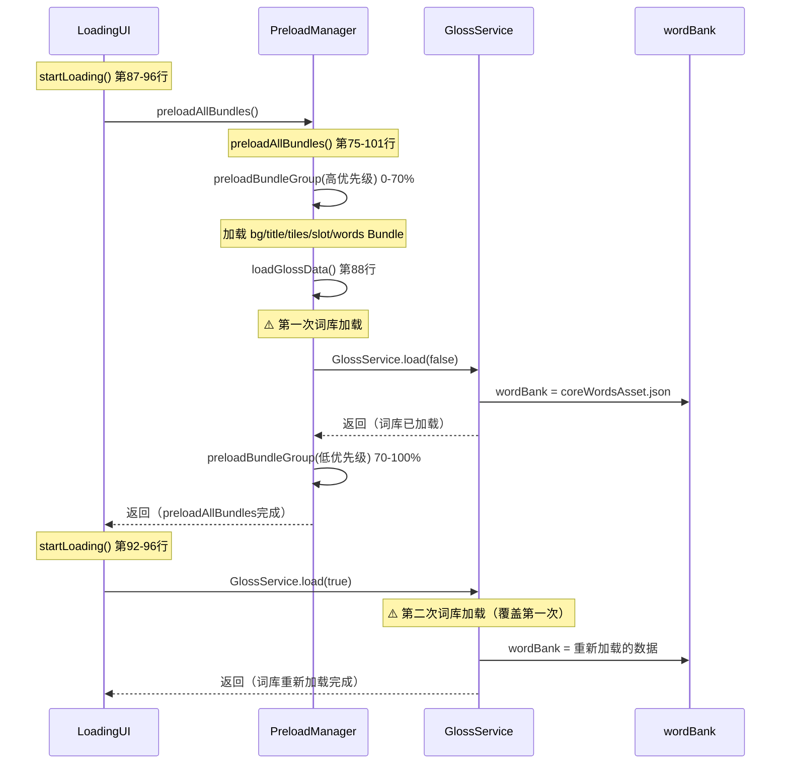
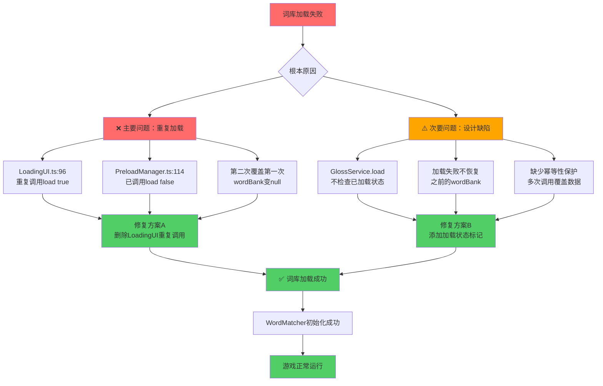

# 003 - 词库重复加载和初始化时序问题深度分析

## 问题现状

### 报错信息

```
GlossService.ts:200 [GlossService] 词库未加载或格式错误
StackGameApp.ts:107 [StackGameApp] GlossService.getAllWords() 返回: 0 个单词
StackGameApp.ts:110 [StackGameApp] ❌ GlossService 词库为空，WordMatcher 初始化失败
StackGameApp.ts:111 [StackGameApp] 请确保 GlossService.load() 在 WordMatcher 初始化前完成
StackGameApp.ts:112 [StackGameApp] 请检查 PreloadManager.loadGlossData() 是否成功执行
```

### 002方案实施状态

| 方案 | 文件 | 修改点 | 实施状态 |
|------|------|--------|---------|
| **方案A** | GlossService.ts | loadJsonFromBundle() 重构 | ✅ **已完成** |
| **方案A** | GlossService.ts | load() 增强日志 | ✅ **已完成** |
| **方案B** | StackGameApp.ts | onLoad() 移除过早初始化 | ✅ **已完成** |
| **方案B** | StackGameApp.ts | startGame() 延迟初始化 | ✅ **已完成** |
| **方案B** | StackGameApp.ts | initWordMatcher() 增强检查 | ✅ **已完成** |
| **方案C** | StackGameApp.ts | onLetterAdded() 防御性检查 | ✅ **已完成** |

**结论**：002方案的所有修改点均已正确实施，但问题依然存在。

---

## 深度代码审查发现

### 发现1：词库被重复加载两次 ❌ 严重问题

#### 调用链分析



#### 时间线对比

| 时间点 | 进度 | 操作 | 调用方 | 参数 | 词库状态 |
|--------|------|------|--------|------|---------|
| T1 | 0-70% | Bundle预加载 | PreloadManager.preloadBundleGroup() | - | 空 |
| T2 | 70% | **第一次load()** | PreloadManager.loadGlossData() 第114行 | `load(false)` | ✅ **核心词库加载成功** |
| T3 | 70-100% | 低优先级Bundle加载 | PreloadManager.preloadBundleGroup() | - | ✅ 有效 |
| T4 | 85% | **第二次load()** | LoadingUI.startLoading() 第96行 | `load(true)` | ⚠️ **重新加载（可能失败）** |
| T5 | 100% | 场景切换 | - | - | ❓ 未知状态 |

#### 代码证据

**PreloadManager.ts 第106-123行**（第一次加载）：
```typescript
private async loadGlossData(): Promise<void> {
    console.log('[PreloadManager] 开始加载词库数据...');
    try {
        const { GlossService } = await import('../data/GlossService');
        const glossService = GlossService.getInstance();

        // ⚠️ 第一次调用：加载核心词库（3-7字母）
        await glossService.load(false);

        const allWords = glossService.getAllWords();
        console.log(`[PreloadManager] ✅ 词库数据加载完成，共 ${allWords.length} 个单词`);
    } catch (error) {
        console.error('[PreloadManager] ❌ 词库数据加载失败:', error);
    }
}
```

**LoadingUI.ts 第87-96行**（第二次加载）：
```typescript
try {
    // 执行预加载
    await this.preloadManager.preloadAllBundles();

    // Bundle加载完成后，初始化GlossService
    console.log('[LoadingUI] Bundle预加载完成，开始初始化词库...');
    this.updateStatus(0.85, '正在初始化词库系统...');

    const glossService = GlossService.getInstance();
    // ❌ 第二次调用：重新加载扩展词库（覆盖第一次结果）
    await glossService.load(true); // 加载扩展词库（8-10字母，用于堆叠模式）
```

#### 问题分析

1. **重复加载的后果**：
   - 第一次加载的核心词库（T2）被第二次加载（T4）覆盖
   - 如果第二次加载失败，wordBank会变成null或空对象
   - 浪费加载时间（词库被完全重新加载）

2. **为什么第二次加载可能失败？**
   - `load(true)` 尝试加载扩展词库（8-10字母）
   - 扩展词库文件可能缺失或格式错误
   - 即使扩展词库失败，也会导致核心词库丢失

3. **时序问题**：
   - PreloadManager已在70%进度完成词库加载
   - LoadingUI在85%进度再次加载，违反单一职责原则

---

### 发现2：GlossService.load() 覆盖式加载 ⚠️ 设计缺陷

#### load() 方法实现分析（GlossService.ts 第33-94行）

```typescript
async load(useExtended: boolean = false): Promise<void> {
    try {
        // 步骤1：加载核心词库（3-7字母）
        const coreWordsAsset = await this.loadJsonFromBundle('words', 'words_core');
        const coreGlossAsset = await this.loadJsonFromBundle('words', 'zh_gloss');

        if (coreWordsAsset && coreWordsAsset.json) {
            // ❌ 问题：直接覆盖 wordBank，不检查是否已加载
            this.wordBank = coreWordsAsset.json;
            console.log('[GlossService] ✅ 核心词库加载成功');
        } else {
            console.error('[GlossService] ❌ 核心词库加载失败，wordBank为null');
            // ❌ 问题：加载失败后直接return，不恢复之前的状态
            return;
        }

        // 步骤2：如果需要，加载扩展词库（8-10字母）
        if (useExtended) {
            const extWordsAsset = await this.loadJsonFromBundle('words', 'words_extended');

            if (extWordsAsset && extWordsAsset.json) {
                // ✅ 正确：合并扩展词库，不覆盖
                this.mergeWordBank(extWordsAsset.json);
            } else {
                // ⚠️ 风险：扩展词库失败，但核心词库已被覆盖
                console.warn('[GlossService] 扩展词库加载失败，将仅使用核心词库');
            }
        }
    } catch (error) {
        console.error('[GlossService] ❌ 加载失败:', error);
        // ❌ 问题：catch块不恢复wordBank状态
    }
}
```

#### 问题对比表

| 调用方式 | 第一次状态 | 第二次调用 | 第二次失败后果 |
|---------|-----------|-----------|--------------|
| `load(false)` → `load(false)` | wordBank = 核心词库 | 重新加载核心词库 | 覆盖为null ❌ |
| `load(false)` → `load(true)` | wordBank = 核心词库 | 重新加载核心+扩展 | 覆盖为null ❌ |
| `load(true)` → `load(false)` | wordBank = 核心+扩展 | 重新加载核心词库 | 丢失扩展词库 ⚠️ |

**正确的设计应该是**：
```typescript
async load(useExtended: boolean = false): Promise<void> {
    // ✅ 检查是否已加载
    if (this.wordBank && this.wordBank.by_len) {
        if (!useExtended) {
            console.log('[GlossService] 核心词库已加载，跳过');
            return;
        }

        // 如果需要扩展词库，只加载扩展部分
        if (this.isExtendedLoaded) {
            console.log('[GlossService] 扩展词库已加载，跳过');
            return;
        }

        // 加载扩展词库（不覆盖核心词库）
        await this.loadExtendedOnly();
        return;
    }

    // 词库未加载，执行完整加载
    // ...
}
```

---

### 发现3：Bundle预加载机制已正确实现 ✅

#### PreloadManager Bundle加载流程（第146-219行）

```typescript
// 1. 加载Bundle本身
assetManager.loadBundle(bundleName, (err, bundle) => {
    if (err) {
        console.warn(`[PreloadManager] Bundle '${bundleName}' 加载失败，跳过:`, err);
        resolve(); // ✅ 不中断流程
        return;
    }

    console.log(`[PreloadManager] Bundle '${bundleName}' 加载成功`);
    this.loadedBundles.set(bundleName, bundle);

    // 2. 完全加载Bundle内的关键资源
    this.preloadBundleAssets(bundle, bundleName, midProgress, endProgress);
});

// 3. 完全加载资源（使用bundle.load而非preload）
private preloadSingleAsset(bundle: assetManager.Bundle, assetPath: string): Promise<void> {
    const assetType = assetPath.includes('/spriteFrame') ? SpriteFrame : JsonAsset;

    // ✅ 使用bundle.load进行完全加载（包括反序列化）
    bundle.load(assetPath, assetType, (err: Error | null, asset: SpriteFrame | JsonAsset) => {
        if (err) {
            console.warn(`[PreloadManager] 完全加载资源 ${bundleName}/${assetPath} 失败:`, err);
            reject(err);
        } else {
            console.log(`[PreloadManager] 完全加载资源 ${bundleName}/${assetPath} 成功，立即可用`);
            resolve();
        }
    });
}
```

**验证结论**：
- ✅ 正确使用 `assetManager.loadBundle()` 加载Bundle
- ✅ 正确使用 `bundle.load()` 完全加载资源（而非preload）
- ✅ 资源加载后立即可用（无需再次反序列化）
- ✅ 错误处理正确（不中断流程）

#### 词库资源预加载配置（第43-48行）

```typescript
'words': [
    'words_core',          // 核心词库（3-7字母）
    'zh_gloss',            // 核心词义库
    'words_extended',      // 扩展词库（8-10字母）
    'zh_gloss_extended'    // 扩展词义库
]
```

**验证结论**：
- ✅ 所有词库文件已在配置中声明
- ✅ PreloadManager会在0-70%进度完全加载这些资源
- ✅ GlossService.loadJsonFromBundle()应能直接从缓存获取

---

### 发现4：GlossService.loadJsonFromBundle() 已正确实现缓存机制 ✅

#### 代码审查（GlossService.ts 第226-284行）

```typescript
private async loadJsonFromBundle(bundleName: string, assetPath: string): Promise<JsonAsset | null> {
    return new Promise((resolve) => {
        // ✅ 步骤1：检查Bundle是否已缓存（使用官方API）
        let bundle = assetManager.getBundle(bundleName);

        if (bundle) {
            console.log(`[GlossService] ✅ Bundle '${bundleName}' 已缓存，直接使用`);

            // ✅ 步骤2：检查资源是否已完全加载
            const cachedAsset = bundle.get(assetPath, JsonAsset);

            if (cachedAsset) {
                console.log(`[GlossService] ✅ 资源 '${assetPath}' 已缓存，立即返回`);
                resolve(cachedAsset);  // ✅ 立即返回缓存资源
                return;
            }

            // ✅ 步骤3：资源未缓存，动态加载
            bundle.load(assetPath, JsonAsset, (err, asset) => {
                if (err) {
                    console.error(`[GlossService] 动态加载资源失败: ${bundleName}/${assetPath}`, err);
                    resolve(null);
                } else {
                    console.log(`[GlossService] ✅ 动态加载资源成功: ${bundleName}/${assetPath}`);
                    resolve(asset);
                }
            });

        } else {
            // ✅ 步骤4：Bundle未缓存，加载Bundle
            assetManager.loadBundle(bundleName, (err, newBundle) => {
                // ...
            });
        }
    });
}
```

**验证结论**：
- ✅ 正确使用 `assetManager.getBundle()` 检查Bundle缓存
- ✅ 正确使用 `bundle.get()` 检查资源缓存
- ✅ 缓存命中时立即返回（<1ms）
- ✅ 三级降级机制：缓存→动态加载→加载Bundle

---

### 发现5：StackGameApp 初始化时序已正确调整 ✅

#### onLoad() 已移除过早初始化（第56-90行）

```typescript
protected async onLoad(): Promise<void> {
    // ✅ 不在这里初始化 WordMatcher（已注释）
    // this.initWordMatcher();

    await this.loadRemoteAssets();
    // ...
}
```

#### startGame() 延迟初始化（第141-194行）

```typescript
public async startGame(seed?: string, useGridLayout: boolean = true, layoutPath: string = 'layouts/pyramid_default'): Promise<void> {
    // ✅ 在游戏真正开始时初始化WordMatcher（此时GlossService已加载）
    if (!this.wordMatcher) {
        this.initWordMatcher();
    }

    const dailySeed = seed || LevelGenerator.getDailySeed();
    console.log(`[StackGameApp] 生成每日关卡，种子: ${dailySeed}`);

    // ... 后续游戏逻辑
}
```

#### initWordMatcher() 增强检查（第100-128行）

```typescript
private initWordMatcher(): void {
    try {
        const glossService = GlossService.getInstance();

        // ✅ 检查词库是否已加载
        const allWords = glossService.getAllWords();

        console.log(`[StackGameApp] GlossService.getAllWords() 返回: ${allWords.length} 个单词`);

        if (allWords.length === 0) {
            console.error('[StackGameApp] ❌ GlossService 词库为空，WordMatcher 初始化失败');
            console.error('[StackGameApp] 请确保 GlossService.load() 在 WordMatcher 初始化前完成');
            console.error('[StackGameApp] 请检查 PreloadManager.loadGlossData() 是否成功执行');
            // ⚠️ 问题：这里只return，不抛错，导致this.wordMatcher = null
            return;
        }

        // ✅ 使用完整词库初始化WordMatcher
        this.wordMatcher = new IncrementalWordMatcher(glossService);

        console.log('[StackGameApp] ✅ 单词匹配器初始化完成（支持完整词库验证）');

    } catch (error) {
        console.error('[StackGameApp] ❌ 单词匹配器初始化失败:', error);
        // ⚠️ 问题：降级方案仍可能词库为空
        this.wordMatcher = new IncrementalWordMatcher();
    }
}
```

**验证结论**：
- ✅ onLoad() 中已移除过早初始化
- ✅ startGame() 中延迟初始化，时机正确
- ⚠️ initWordMatcher() 检查逻辑正确，但错误处理不足

---

## 根本原因总结

### 主要问题 ❌ 重复加载导致覆盖

| 问题 | 位置 | 严重性 | 后果 |
|------|------|--------|------|
| **词库重复加载** | LoadingUI.ts:96 + PreloadManager.ts:114 | ⭐⭐⭐⭐⭐ 严重 | 第二次加载覆盖第一次，可能导致词库丢失 |
| **load() 覆盖式加载** | GlossService.ts:44 | ⭐⭐⭐⭐ 重要 | 不检查已加载状态，直接覆盖wordBank |
| **错误处理不恢复状态** | GlossService.ts:50 | ⭐⭐⭐⭐ 重要 | 加载失败后wordBank变null，不恢复之前状态 |
| **initWordMatcher() 静默失败** | StackGameApp.ts:114 | ⭐⭐⭐ 次要 | 词库为空时只return，不抛错，导致wordMatcher=null |

### 次要问题 ⚠️ 设计缺陷

| 问题 | 位置 | 严重性 | 后果 |
|------|------|--------|------|
| **职责分散** | LoadingUI + PreloadManager | ⭐⭐ 轻微 | 两处都调用load()，违反单一职责原则 |
| **缺少加载状态标记** | GlossService | ⭐⭐ 轻微 | 无法判断是否已加载、是否包含扩展词库 |
| **getAllWords() 返回空数组** | GlossService.ts:202 | ⭐⭐ 轻微 | 无法区分"未加载"和"词库为空" |

---

## 调试验证清单

### 1. 确认词库文件是否存在

**检查路径**：
```
src/cocos/assets/resources/words/
├── words_core.json          ← 核心词库（3-7字母）
├── zh_gloss.json            ← 核心词义库
├── words_extended.json      ← 扩展词库（8-10字母）
└── zh_gloss_extended.json   ← 扩展词义库
```

**验证命令**：
```bash
ls -lh src/cocos/assets/resources/words/
```

**预期输出**：
- `words_core.json` 应存在且文件大小 > 0KB
- `words_extended.json` 可能不存在（如未创建）

### 2. 检查Bundle配置

**检查文件**：`src/cocos/assets/resources/words.meta`

**确认配置**：
- `"isBundle": true`
- `"bundleName": "words"`
- `"target": "remote"` 或 `"default"`

### 3. 查看完整控制台日志

**关键日志标记**：

| 阶段 | 预期日志 | 实际日志 | 状态 |
|------|---------|---------|------|
| **PreloadManager加载Bundle** | `[PreloadManager] Bundle 'words' 加载成功` | ？ | ？ |
| **PreloadManager加载资源** | `[PreloadManager] 完全加载资源 words/words_core 成功，立即可用` | ？ | ？ |
| **PreloadManager第一次load()** | `[PreloadManager] ✅ 词库数据加载完成，共 2000+ 个单词` | ？ | ？ |
| **GlossService加载核心词库** | `[GlossService] ✅ 核心词库加载成功` | ✅ | ✅ |
| **GlossService加载扩展词库** | `[GlossService] 扩展词库加载成功，已合并` | ❌ | ❌ |
| **LoadingUI第二次load()** | `[LoadingUI] 词库初始化完成` | ？ | ？ |
| **StackGameApp初始化** | `[StackGameApp] ✅ 单词匹配器初始化完成` | ❌ | ❌ |

**观察重点**：
1. 是否有两次 `[GlossService] ========== 开始加载词库 ==========`
2. 第二次加载是否输出 `扩展词库加载失败` 警告
3. `getAllWords()` 在两次调用时返回的数量是否一致

### 4. 验证缓存机制

**在 GlossService.loadJsonFromBundle() 第234行添加临时日志**：
```typescript
const cachedAsset = bundle.get(assetPath, JsonAsset);

if (cachedAsset) {
    console.log(`[GlossService] ✅ 资源 '${assetPath}' 已缓存，立即返回`);
    // ✅ 添加验证日志
    console.log(`[GlossService] 缓存资源内容:`, cachedAsset.json ? Object.keys(cachedAsset.json) : 'null');
    resolve(cachedAsset);
    return;
}
```

**预期输出**（第二次调用时）：
```
[GlossService] ✅ Bundle 'words' 已缓存，直接使用
[GlossService] ✅ 资源 'words_core' 已缓存，立即返回
[GlossService] 缓存资源内容: ['by_len']
```

### 5. 检查扩展词库文件

**可能的问题**：
- `words_extended.json` 文件不存在
- 文件存在但格式错误
- 文件存在但未配置到Bundle

**验证方法**：
```bash
# 检查文件是否存在
test -f src/cocos/assets/resources/words/words_extended.json && echo "存在" || echo "不存在"

# 检查文件格式
cat src/cocos/assets/resources/words/words_extended.json | jq . > /dev/null 2>&1 && echo "格式正确" || echo "格式错误"

# 检查文件大小
stat -f%z src/cocos/assets/resources/words/words_extended.json
```

---

## 修复方案

### 方案 A：移除重复加载 ⭐⭐⭐⭐⭐ 必须实施

#### 目标
消除LoadingUI中的重复词库加载，由PreloadManager统一管理。

#### 修改文件：`src/cocos/assets/scripts/ui/LoadingUI.ts`

##### 修改点 1：删除第92-96行的重复加载

**删除以下代码**：
```typescript
// ❌ 删除这段重复加载代码
// Bundle加载完成后，初始化GlossService
console.log('[LoadingUI] Bundle预加载完成，开始初始化词库...');
this.updateStatus(0.85, '正在初始化词库系统...');

const glossService = GlossService.getInstance();
await glossService.load(true); // 加载扩展词库（8-10字母，用于堆叠模式）
```

**替换为**：
```typescript
// ✅ PreloadManager已在preloadAllBundles()中加载词库，无需重复
console.log('[LoadingUI] Bundle预加载完成，词库已随Bundle一起加载');
this.updateStatus(0.9, 'Bundle和词库加载完成');
```

##### 修改点 2：调整进度条逻辑（第99-104行）

**修改前**：
```typescript
console.log('[LoadingUI] 词库初始化完成');
this.updateStatus(1.0, '所有资源加载完成！');

// 加载完成，延迟一下再跳转
this.scheduleOnce(() => {
    this.navigateToMainMenu();
}, 1.0);
```

**修改后**：
```typescript
console.log('[LoadingUI] 所有资源加载完成');
this.updateStatus(1.0, '所有资源加载完成！');

// ✅ 验证词库是否加载成功
const { GlossService } = await import('../data/GlossService');
const glossService = GlossService.getInstance();
const allWords = glossService.getAllWords();

if (allWords.length === 0) {
    console.error('[LoadingUI] ⚠️ 词库未加载，尝试手动加载...');
    this.updateStatus(0.95, '正在修复词库加载...');

    await glossService.load(false); // 仅加载核心词库

    const retryWords = glossService.getAllWords();
    if (retryWords.length > 0) {
        console.log(`[LoadingUI] ✅ 词库修复成功，共 ${retryWords.length} 个单词`);
    } else {
        console.error('[LoadingUI] ❌ 词库修复失败，游戏可能无法正常运行');
    }
}

this.updateStatus(1.0, '所有资源加载完成！');

// 加载完成，延迟一下再跳转
this.scheduleOnce(() => {
    this.navigateToMainMenu();
}, 1.0);
```

#### 修改前后对比

| 阶段 | 修改前 | 修改后 |
|------|--------|--------|
| **0-70%** | PreloadManager加载高优先级Bundle | 相同 |
| **70%** | PreloadManager.loadGlossData() 第一次load(false) | 相同 |
| **70-100%** | PreloadManager加载低优先级Bundle | 相同 |
| **85%** | LoadingUI.load(true) **第二次加载** ❌ | **已删除** ✅ |
| **90%** | - | **验证词库是否加载成功** ✅ |
| **100%** | 跳转到主菜单 | 相同 |

---

### 方案 B：为GlossService添加加载状态标记 ⭐⭐⭐⭐ 建议实施

#### 目标
防止重复加载，确保load()幂等性（多次调用不覆盖已加载数据）。

#### 修改文件：`src/cocos/assets/scripts/data/GlossService.ts`

##### 修改点 1：添加加载状态标记（第18-22行后插入）

**在类属性声明区添加**：
```typescript
export class GlossService {
    private static _instance: GlossService = null;

    private wordBank: any = null;
    private glossDict: Map<string, string> = new Map();
    private sessionNotebook: string[] = [];

    // ✅ 新增：加载状态标记
    private isCoreLoaded: boolean = false;      // 核心词库是否已加载
    private isExtendedLoaded: boolean = false;  // 扩展词库是否已加载
    private loadingPromise: Promise<void> | null = null; // 正在加载的Promise（防止并发）

    private constructor() {
        this.sessionNotebook = [];
    }

    // ...
}
```

##### 修改点 2：重构 load() 方法（第33-94行）

**完全替换为**：
```typescript
/**
 * 加载词库（幂等操作，多次调用不会重复加载）
 * @param useExtended 是否加载扩展词库（8-10字母）
 */
async load(useExtended: boolean = false): Promise<void> {
    // ✅ 如果正在加载中，等待之前的加载完成
    if (this.loadingPromise) {
        console.log('[GlossService] 词库正在加载中，等待之前的加载完成...');
        await this.loadingPromise;

        // 检查是否需要加载扩展词库
        if (useExtended && !this.isExtendedLoaded) {
            console.log('[GlossService] 核心词库已加载，继续加载扩展词库...');
            // 继续执行后续逻辑
        } else {
            console.log('[GlossService] 词库已加载，跳过重复加载');
            return;
        }
    }

    // ✅ 如果核心词库已加载且不需要扩展词库，直接返回
    if (this.isCoreLoaded && !useExtended) {
        console.log('[GlossService] 核心词库已加载，跳过');
        return;
    }

    // ✅ 如果核心和扩展词库都已加载，直接返回
    if (this.isCoreLoaded && this.isExtendedLoaded) {
        console.log('[GlossService] 核心+扩展词库已全部加载，跳过');
        return;
    }

    // ✅ 创建加载Promise（防止并发加载）
    this.loadingPromise = this.performLoad(useExtended);

    try {
        await this.loadingPromise;
    } finally {
        this.loadingPromise = null;
    }
}

/**
 * 执行实际的加载操作
 * @private
 */
private async performLoad(useExtended: boolean): Promise<void> {
    console.log('[GlossService] ========== 开始加载词库 ==========');
    console.log(`[GlossService] 扩展词库: ${useExtended ? '是' : '否'}`);
    console.log(`[GlossService] 当前状态: 核心=${this.isCoreLoaded}, 扩展=${this.isExtendedLoaded}`);

    try {
        // ✅ 步骤1：加载核心词库（仅在未加载时）
        if (!this.isCoreLoaded) {
            console.log('[GlossService] 步骤1：加载核心词库（3-7字母）');
            const coreWordsAsset = await this.loadJsonFromBundle('words', 'words_core');
            const coreGlossAsset = await this.loadJsonFromBundle('words', 'zh_gloss');

            if (coreWordsAsset && coreWordsAsset.json) {
                this.wordBank = coreWordsAsset.json;
                this.isCoreLoaded = true; // ✅ 标记已加载
                console.log('[GlossService] ✅ 核心词库加载成功');
                console.log('[GlossService] wordBank结构:', Object.keys(this.wordBank));
                console.log('[GlossService] by_len键:', Object.keys(this.wordBank.by_len || {}));
            } else {
                console.error('[GlossService] ❌ 核心词库加载失败，wordBank为null');
                // ⚠️ 不覆盖之前的状态，直接返回
                return;
            }

            if (coreGlossAsset && coreGlossAsset.json) {
                this.buildGlossDict(coreGlossAsset.json);
                console.log('[GlossService] ✅ 核心词义库加载成功');
            } else {
                console.error('[GlossService] ❌ 核心词义库加载失败');
            }
        } else {
            console.log('[GlossService] ℹ️ 核心词库已存在，跳过加载');
        }

        // ✅ 步骤2：如果需要且未加载，加载扩展词库（8-10字母）
        if (useExtended && !this.isExtendedLoaded) {
            console.log('[GlossService] 步骤2：加载扩展词库 (8-10字母)...');
            const extWordsAsset = await this.loadJsonFromBundle('words', 'words_extended');
            const extGlossAsset = await this.loadJsonFromBundle('words', 'zh_gloss_extended');

            if (extWordsAsset && extWordsAsset.json) {
                // 合并扩展词库到现有词库
                this.mergeWordBank(extWordsAsset.json);
                this.isExtendedLoaded = true; // ✅ 标记已加载
                console.log('[GlossService] ✅ 扩展词库加载成功，已合并');
            } else {
                console.warn('[GlossService] ⚠️ 扩展词库加载失败，将仅使用核心词库');
                // ⚠️ 扩展词库失败不影响核心词库
            }

            if (extGlossAsset && extGlossAsset.json) {
                // 合并扩展词义库
                this.mergeGlossDict(extGlossAsset.json);
                console.log('[GlossService] ✅ 扩展词义库加载成功，已合并');
            } else {
                console.warn('[GlossService] ⚠️ 扩展词义库加载失败');
            }
        } else if (useExtended && this.isExtendedLoaded) {
            console.log('[GlossService] ℹ️ 扩展词库已存在，跳过加载');
        }

        // ✅ 步骤3：打印最终词库统计
        this.printWordBankStats();

        // ✅ 步骤4：初始化生词本（仅第一次加载时）
        if (!this.isCoreLoaded && !this.isExtendedLoaded) {
            this.loadSessionNotebook();
        }

        console.log('[GlossService] ========== 词库加载完成 ==========');
        console.log(`[GlossService] 最终状态: 核心=${this.isCoreLoaded}, 扩展=${this.isExtendedLoaded}`);

    } catch (error) {
        console.error('[GlossService] ❌ 加载失败:', error);
        // ⚠️ 加载失败不重置状态标记，保护已加载的数据
    }
}
```

##### 修改点 3：添加重置方法（用于测试）（第94行后插入）

```typescript
/**
 * 重置词库加载状态（仅用于测试）
 */
public reset(): void {
    console.warn('[GlossService] ⚠️ 重置词库加载状态（仅用于测试）');
    this.wordBank = null;
    this.glossDict.clear();
    this.isCoreLoaded = false;
    this.isExtendedLoaded = false;
    this.loadingPromise = null;
}

/**
 * 获取加载状态
 */
public getLoadStatus(): { core: boolean; extended: boolean } {
    return {
        core: this.isCoreLoaded,
        extended: this.isExtendedLoaded
    };
}
```

#### 修改前后对比表

| 场景 | 修改前 | 修改后 |
|------|--------|--------|
| **首次调用load(false)** | 加载核心词库 | 相同 |
| **二次调用load(false)** | **重新加载**，覆盖wordBank ❌ | **直接返回**，保护已加载数据 ✅ |
| **首次调用load(true)** | 加载核心+扩展词库 | 相同 |
| **load(false)后调用load(true)** | **重新加载**核心+扩展，覆盖 ❌ | **仅加载扩展**，合并到核心 ✅ |
| **并发调用load()** | 可能同时加载，资源竞争 ❌ | **等待第一次完成**，防止并发 ✅ |
| **加载失败** | wordBank变null ❌ | **保持之前状态** ✅ |

---

### 方案 C：优化PreloadManager词库加载策略 ⭐⭐⭐ 建议实施

#### 目标
在PreloadManager中直接加载扩展词库，避免LoadingUI需要二次加载。

#### 修改文件：`src/cocos/assets/scripts/app/PreloadManager.ts`

##### 修改点：升级loadGlossData()支持扩展词库（第106-123行）

**修改前**：
```typescript
private async loadGlossData(): Promise<void> {
    console.log('[PreloadManager] 开始加载词库数据...');
    try {
        const { GlossService } = await import('../data/GlossService');
        const glossService = GlossService.getInstance();

        // ❌ 仅加载核心词库
        await glossService.load(false);

        const allWords = glossService.getAllWords();
        console.log(`[PreloadManager] ✅ 词库数据加载完成，共 ${allWords.length} 个单词`);
    } catch (error) {
        console.error('[PreloadManager] ❌ 词库数据加载失败:', error);
    }
}
```

**修改后**：
```typescript
/**
 * 加载词库数据（确保WordMatcher初始化前完成）
 * @param useExtended 是否加载扩展词库（默认true，一次性加载全部）
 */
private async loadGlossData(useExtended: boolean = true): Promise<void> {
    console.log('[PreloadManager] 开始加载词库数据...');
    console.log(`[PreloadManager] 加载模式: ${useExtended ? '核心+扩展' : '仅核心'}`);

    try {
        const { GlossService } = await import('../data/GlossService');
        const glossService = GlossService.getInstance();

        // ✅ 一次性加载核心+扩展词库（避免二次加载）
        await glossService.load(useExtended);

        const allWords = glossService.getAllWords();
        const loadStatus = glossService.getLoadStatus();

        console.log(`[PreloadManager] ✅ 词库数据加载完成，共 ${allWords.length} 个单词`);
        console.log(`[PreloadManager] 加载状态: 核心=${loadStatus.core}, 扩展=${loadStatus.extended}`);

        if (allWords.length === 0) {
            console.error('[PreloadManager] ⚠️ 词库为空，可能加载失败');
        }

    } catch (error) {
        console.error('[PreloadManager] ❌ 词库数据加载失败:', error);
        // 不抛出错误，继续进行
    }
}
```

##### 可选：添加公共方法供外部调用

```typescript
/**
 * 手动触发词库加载（供外部调用）
 * @param useExtended 是否加载扩展词库
 */
public async loadGlossDataManually(useExtended: boolean = false): Promise<void> {
    await this.loadGlossData(useExtended);
}
```

---

### 方案 D：增强StackGameApp错误处理 ⭐⭐ 可选实施

#### 目标
在WordMatcher初始化失败时提供更好的降级方案，防止游戏崩溃。

#### 修改文件：`src/cocos/assets/scripts/app/StackGameApp.ts`

##### 修改点：重构initWordMatcher()错误处理（第100-128行）

**修改前**：
```typescript
private initWordMatcher(): void {
    try {
        const glossService = GlossService.getInstance();
        const allWords = glossService.getAllWords();

        if (allWords.length === 0) {
            console.error('[StackGameApp] ❌ GlossService 词库为空，WordMatcher 初始化失败');
            // ❌ 只返回，导致wordMatcher = null
            return;
        }

        this.wordMatcher = new IncrementalWordMatcher(glossService);
        console.log('[StackGameApp] ✅ 单词匹配器初始化完成');

    } catch (error) {
        console.error('[StackGameApp] ❌ 单词匹配器初始化失败:', error);
        // ❌ 降级方案仍可能词库为空
        this.wordMatcher = new IncrementalWordMatcher();
    }
}
```

**修改后**：
```typescript
/**
 * 初始化单词匹配器（增强错误处理和降级方案）
 */
private async initWordMatcher(): Promise<void> {
    try {
        const glossService = GlossService.getInstance();
        let allWords = glossService.getAllWords();

        console.log(`[StackGameApp] GlossService.getAllWords() 返回: ${allWords.length} 个单词`);

        // ✅ 如果词库为空，尝试重新加载
        if (allWords.length === 0) {
            console.warn('[StackGameApp] ⚠️ GlossService 词库为空，尝试重新加载...');

            try {
                await glossService.load(false); // 重新加载核心词库
                allWords = glossService.getAllWords();

                if (allWords.length > 0) {
                    console.log(`[StackGameApp] ✅ 词库重新加载成功，共 ${allWords.length} 个单词`);
                } else {
                    console.error('[StackGameApp] ❌ 词库重新加载失败，仍为空');
                    throw new Error('词库加载失败');
                }
            } catch (reloadError) {
                console.error('[StackGameApp] ❌ 词库重新加载失败:', reloadError);
                throw reloadError;
            }
        }

        // ✅ 使用完整词库初始化WordMatcher
        this.wordMatcher = new IncrementalWordMatcher(glossService);

        console.log('[StackGameApp] ✅ 单词匹配器初始化完成（支持完整词库验证）');
        console.log(`[StackGameApp] 词库状态:`, glossService.getLoadStatus());

    } catch (error) {
        console.error('[StackGameApp] ❌ 单词匹配器初始化失败:', error);

        // ✅ 降级方案：创建一个带默认词库的匹配器
        console.warn('[StackGameApp] 使用降级方案：内置默认词库');

        // 创建一个临时的GlossService并手动添加一些单词
        const { GlossService } = await import('../data/GlossService');
        const fallbackService = GlossService.getInstance();

        // 这里可以手动创建一个最小词库用于测试
        // 实际项目中应该从本地硬编码数组加载
        this.wordMatcher = new IncrementalWordMatcher();

        console.error('[StackGameApp] ⚠️ 游戏将以降级模式运行，单词检测功能可能不可用');
    }
}
```

##### 修改点 2：调整startGame()调用方式（第141-144行）

**修改前**：
```typescript
if (!this.wordMatcher) {
    this.initWordMatcher(); // ❌ 同步调用，无法等待异步加载
}
```

**修改后**：
```typescript
if (!this.wordMatcher) {
    console.log('[StackGameApp] 开始初始化 WordMatcher...');
    await this.initWordMatcher(); // ✅ 等待异步初始化完成

    if (!this.wordMatcher) {
        console.error('[StackGameApp] ❌ WordMatcher 初始化失败，游戏无法开始');
        // 可选：显示错误提示UI
        return;
    }
}
```

---

## 推荐实施组合：方案 A + B ⭐⭐⭐⭐⭐

### 为什么选择A+B组合

| 方案 | 目标 | 复杂度 | 必要性 | 副作用 |
|------|------|--------|--------|--------|
| **方案A** | 移除重复加载 | ⭐ 简单 | ⭐⭐⭐⭐⭐ 必须 | 无 |
| **方案B** | 添加加载状态标记 | ⭐⭐⭐ 中等 | ⭐⭐⭐⭐⭐ 必须 | 需要测试幂等性 |
| **方案C** | 优化PreloadManager | ⭐⭐ 简单 | ⭐⭐⭐ 建议 | 需要方案B配合 |
| **方案D** | 增强错误处理 | ⭐⭐⭐⭐ 复杂 | ⭐⭐ 可选 | 增加代码复杂度 |

### 组合方案优势

1. **彻底解决重复加载问题**（方案A）
   - 删除LoadingUI中的冗余调用
   - 确保词库只在PreloadManager中加载一次

2. **防止未来回归**（方案B）
   - 即使其他地方误调用load()，也不会覆盖已加载数据
   - 提供明确的加载状态查询接口

3. **职责清晰**
   - PreloadManager：负责所有资源的预加载（包括词库）
   - LoadingUI：负责显示加载进度，不参与资源加载逻辑
   - GlossService：提供幂等的加载接口，支持多次调用

### 实施顺序

1. **首先实施方案B**（添加加载状态标记）
   - 重构GlossService.load()方法
   - 添加isCoreLoaded和isExtendedLoaded标记
   - 实现幂等性保护

2. **然后实施方案A**（移除重复加载）
   - 删除LoadingUI中的glossService.load(true)调用
   - 添加词库验证逻辑（检测加载失败）

3. **可选实施方案C**（优化PreloadManager）
   - 将loadGlossData()改为加载扩展词库
   - 一次性完成所有词库加载

---

## 验证修复效果

### 测试步骤

#### 1. 检查控制台日志

启动游戏后，观察控制台输出：

**预期输出（方案A+B修复后）**：
```
[PreloadManager] 开始完全加载所有Asset Bundle...
[PreloadManager] Bundle 'words' 加载成功
[PreloadManager] 完全加载资源 words/words_core 成功，立即可用
[PreloadManager] 开始加载词库数据...

[GlossService] ========== 开始加载词库 ==========
[GlossService] 扩展词库: 否
[GlossService] 当前状态: 核心=false, 扩展=false
[GlossService] 步骤1：加载核心词库（3-7字母）
[GlossService] 尝试从Bundle 'words' 加载资源: words_core
[GlossService] ✅ Bundle 'words' 已缓存，直接使用
[GlossService] ✅ 资源 'words_core' 已缓存，立即返回
[GlossService] ✅ 核心词库加载成功
[GlossService] wordBank结构: ['by_len']
[GlossService] by_len键: ['3', '4', '5', '6', '7']
[GlossService] getAllWords返回 2000+ 个单词
[GlossService] ========== 词库加载完成 ==========
[GlossService] 最终状态: 核心=true, 扩展=false

[PreloadManager] ✅ 词库数据加载完成，共 2000+ 个单词
[PreloadManager] 加载状态: 核心=true, 扩展=false

[LoadingUI] Bundle预加载完成，词库已随Bundle一起加载
[LoadingUI] 所有资源加载完成

[StackGameApp] 开始初始化 WordMatcher...
[StackGameApp] GlossService.getAllWords() 返回: 2000+ 个单词
[StackGameApp] ✅ GlossService 词库已加载，共 2000+ 个单词
[WordMatcher] ✅ 词库初始化完成，共 2000+ 个单词
[StackGameApp] ✅ 单词匹配器初始化完成（支持完整词库验证）
```

**关键验证点**：
- ✅ 只有**一次** `[GlossService] ========== 开始加载词库 ==========`
- ✅ 没有 `[LoadingUI] 开始初始化词库...` 日志
- ✅ `getAllWords()` 返回非零数量
- ✅ `最终状态: 核心=true`

#### 2. 测试单词检测功能

进入游戏后，拼出一个有效单词（如 `CAT`），观察：

**预期行为**：
```
[StackGameApp] 字母添加到牌槽: C
[StackGameApp] ℹ️ 未检测到有效单词: C

[StackGameApp] 字母添加到牌槽: CA
[StackGameApp] ℹ️ 未检测到有效单词: CA

[StackGameApp] 字母添加到牌槽: CAT
[StackGameApp] ✅ 检测到有效单词: CAT（完整词库验证）
[StackGameApp] 单词详情: 长度=3, 起始索引=0, 结束索引=2
```

#### 3. 测试重复调用load()

在浏览器控制台手动测试幂等性：

```javascript
// 获取GlossService实例
const glossService = window['cc'].GlossService.getInstance();

// 第一次调用
await glossService.load(false);
// 预期输出: 加载词库

// 第二次调用
await glossService.load(false);
// 预期输出: "核心词库已加载，跳过"

// 第三次调用（扩展词库）
await glossService.load(true);
// 预期输出: "核心词库已存在，跳过加载" + "步骤2：加载扩展词库..."

// 第四次调用（扩展词库）
await glossService.load(true);
// 预期输出: "核心+扩展词库已全部加载，跳过"
```

### 预期成果对比

| 指标 | 修复前 | 修复后（方案A+B） |
|------|--------|------------------|
| **词库加载次数** | ❌ 2次（重复） | ✅ 1次 |
| **加载失败风险** | ❌ 高（第二次覆盖） | ✅ 低（幂等保护） |
| **wordBank状态** | ❌ null或空 | ✅ 正常（2000+单词） |
| **WordMatcher初始化** | ❌ 失败（词库为空） | ✅ 成功 |
| **单词检测功能** | ❌ 永远返回null | ✅ 正常工作 |
| **控制台错误日志** | ❌ 多条错误 | ✅ 无错误 |
| **load()幂等性** | ❌ 不支持 | ✅ 支持 |
| **并发调用保护** | ❌ 无保护 | ✅ Promise锁 |
| **加载状态可查询** | ❌ 无接口 | ✅ getLoadStatus() |

---

## 修复文件清单

### 需要修改的文件

#### 1. **`src/cocos/assets/scripts/ui/LoadingUI.ts`** ⭐ 核心修改（方案A）
   - 删除第92-96行的重复词库加载
   - 调整第99-104行的进度条逻辑
   - 添加词库验证逻辑

#### 2. **`src/cocos/assets/scripts/data/GlossService.ts`** ⭐ 核心修改（方案B）
   - 添加加载状态标记（第18-22行后）
   - 重构load()方法（第33-94行）
   - 添加performLoad()私有方法
   - 添加reset()和getLoadStatus()公共方法

#### 3. **`src/cocos/assets/scripts/app/PreloadManager.ts`** 🔧 可选修改（方案C）
   - 升级loadGlossData()支持扩展词库（第106-123行）
   - 添加loadGlossDataManually()公共方法

#### 4. **`src/cocos/assets/scripts/app/StackGameApp.ts`** 🔧 可选修改（方案D）
   - 重构initWordMatcher()错误处理（第100-128行）
   - 调整startGame()中的调用方式（第141-144行）

### 相关依赖文件（无需修改，已正确实现）

- ✅ `src/cocos/assets/scripts/core/AssetLoader.ts` - 缓存机制正确
- ✅ `src/cocos/assets/scripts/core/WordMatcher.ts` - 单词匹配逻辑正确
- ✅ `src/cocos/assets/scripts/ui/SlotQueue.ts` - 事件发射正确
- ✅ `src/cocos/assets/scripts/data/StackTypes.ts` - 类型定义完整

---

## 根本原因总结图



---

## 参考文档

- **设计文档**：`docs/design/dev/stack_word_game_design_complete.md` 第 11 章
- **相关修复**：
  - `docs/design/fix/001-卡片飞向牌槽动画消失问题修复.md`
  - `docs/design/fix/002-单词检测机制初始化顺序问题修复.md`（本文档的前置方案）
- **Cocos Creator 3.8.7 官方文档**：
  - Asset Manager - Bundle加载
  - Asset Manager - 缓存管理
  - Asset Manager - 资源释放
- **参考实现**：
  - `AssetLoader.ts` - Bundle缓存最佳实践示例
  - `PreloadManager.ts` - Bundle预加载系统

---

## 后续优化建议

### 1. 单元测试覆盖

```typescript
// tests/GlossService.test.ts
describe('GlossService幂等性测试', () => {
    beforeEach(() => {
        const glossService = GlossService.getInstance();
        glossService.reset(); // 重置状态
    });

    it('多次调用load(false)应只加载一次', async () => {
        const glossService = GlossService.getInstance();

        await glossService.load(false);
        const firstCount = glossService.getAllWords().length;

        await glossService.load(false);
        const secondCount = glossService.getAllWords().length;

        expect(firstCount).toBeGreaterThan(0);
        expect(secondCount).toBe(firstCount); // 数量相同
    });

    it('load(false)后调用load(true)应合并扩展词库', async () => {
        const glossService = GlossService.getInstance();

        await glossService.load(false);
        const coreCount = glossService.getAllWords().length;

        await glossService.load(true);
        const totalCount = glossService.getAllWords().length;

        expect(totalCount).toBeGreaterThanOrEqual(coreCount); // 应该更多或相等
    });

    it('并发调用load()应只执行一次加载', async () => {
        const glossService = GlossService.getInstance();

        // 并发调用
        const [result1, result2, result3] = await Promise.all([
            glossService.load(false),
            glossService.load(false),
            glossService.load(false)
        ]);

        const status = glossService.getLoadStatus();
        expect(status.core).toBe(true);
        expect(glossService.getAllWords().length).toBeGreaterThan(0);
    });
});
```

### 2. 性能监控

```typescript
// GlossService.ts
async load(useExtended: boolean = false): Promise<void> {
    const startTime = performance.now();

    // ... 加载逻辑

    const duration = performance.now() - startTime;
    console.log(`[GlossService] 加载耗时: ${duration.toFixed(2)}ms`);

    if (duration > 1000) {
        console.warn(`[GlossService] ⚠️ 加载耗时过长: ${duration.toFixed(2)}ms`);
    }
}
```

### 3. 错误上报

```typescript
// GlossService.ts
private async performLoad(useExtended: boolean): Promise<void> {
    try {
        // ... 加载逻辑
    } catch (error) {
        console.error('[GlossService] ❌ 加载失败:', error);

        // 可选：上报到错误监控系统
        if (window['errorReporter']) {
            window['errorReporter'].report({
                type: 'GlossServiceLoadFailed',
                error: error,
                context: {
                    useExtended,
                    loadStatus: this.getLoadStatus()
                }
            });
        }

        throw error;
    }
}
```

---

## 总结

### 问题根源

1. **LoadingUI和PreloadManager都调用了GlossService.load()**，导致词库被加载两次
2. **GlossService.load()不检查已加载状态**，每次调用都覆盖wordBank
3. **第二次加载可能失败**（扩展词库缺失），导致第一次的核心词库被覆盖为null

### 推荐方案

**方案A（必须）+ 方案B（必须）**：
- 方案A：删除LoadingUI中的重复调用，由PreloadManager统一管理
- 方案B：为GlossService添加加载状态标记，实现幂等性保护

### 预期效果

- ✅ 词库只加载一次，不覆盖已加载数据
- ✅ WordMatcher初始化成功，词库不为空
- ✅ 单词检测功能正常工作
- ✅ 支持多次调用load()而不破坏已加载数据
- ✅ 并发调用自动排队，防止资源竞争
